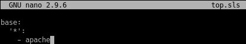
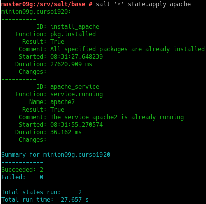

# Salt-stack

## 1.1. Instalación: Master
Empezamos con la instalacion del servicio master de salt.

Modificamos el fichero indicado

Habilitamos el master

## 1.2. Instalación: Minion
Instalamos el servicio salt-minion.

volvemos a editar el fichero que tocamos en master pero esta vez para minion para indicar quien es el master.

Lo habilitamos.

## 1.3. Aceptación desde el master
Con el comando mostradoi en la imagen podemos ver que no tenemos aceptada una clave para el minion, para aceptarla seguimos los pasos de las imagenes para que sea aceptada.

## 1.4. Conectividad
probamos la conectivdad.

## 2. Salt States
vamos a crear estados para el minion, en primer lugar creamos las carpetas donde estaran los estados y las configuraciones.

Creamos el fichero mostrado y reiniciamos el servicio para que funcione.

Ahora crearemos el estado de instalar apache.

En el directorio base crearemos top.sls que se encarga de guardar los estados.

vemos los estados y los aplicamos.

## 3. Estado: users
Haremos el mismo procedimiento que en apartado anterior, pero lo usaremos para crear usuarios.

después de seguir los pasos vemos que funciona el estado.

## 4. Estado: directories
Ahora crearemos directorios.

Igual que en el apartado anterior, vemos que el estado funciona

# 5. Añadir Minion de otro SO
Instalamos el salt_minion en Windows

Ponemos la ip del servidor

añadimos en host de windows y linux las ips y el nombre de las maquinas.

Comprobamos que funciona

