# Docker

## 1. Instalación

Comenzamos cambiando el fichero ip_forward e instalando docker.

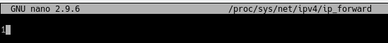

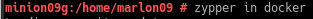

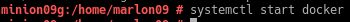

Para ver que funciona haremos unas pruebas.

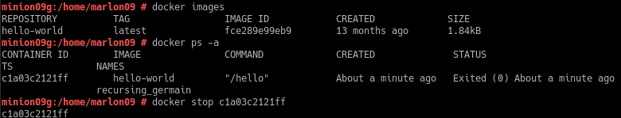

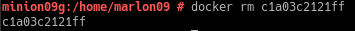

## Creación de imagen

Descargamos una imagen en local y seguido creamos un contenedor.

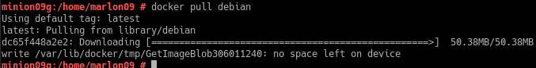

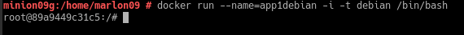

Ahora que accedimos al contenedor vamos a configurarlo a nuestro gusto.

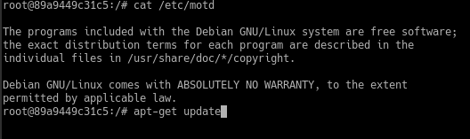

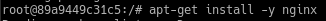

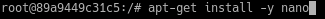

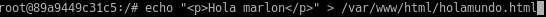

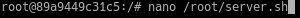

Creamos un script para que inicie el programa, importante darle permisos para que se pueda ejecutar.

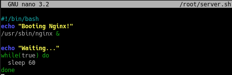

## 3.1 Crear contenedor apartir de la imagen

haremos que inicie desde nuestra imagen anterior

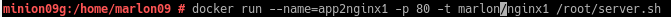

Ahora haremos docker ps para ver el puerto al que se redirige y entraremos en el navegador con la url localhost:(puerto de redirección).

## 3.2 Migrar imagen a otra maquina

Este comando nos permitira guardar la imagen a un .tar para poder exportarla a un compañero

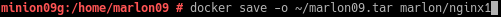

Este comando nos permite cargar la maquina de nuestro compañero.

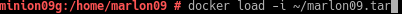

## 4. Dockerfile

Ahora usaremos ficheros de configuración.
En primer lugar crearemos un html, el fichero server.sh y otro Dockerfile en un directorio.

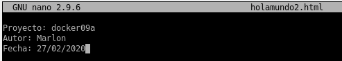

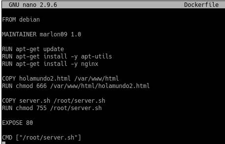

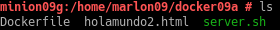

Ahora crearemos la imagen

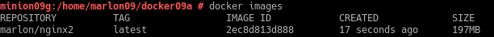

Creamos el contenedor y comprobamos que todo funciona.

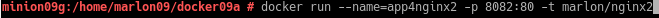

## 4.2 Usar imagen ya creada

En este paso haremos lo mismo que en el paso anterior, pero el fichero dockerfile sera distinto para usar la imagen anterior.

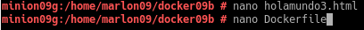

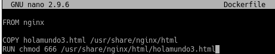

## 5.Crear hola mundo

Creamos un contenedor en otro directorio y usamos el comando indicado a continuación y se nos mostrara un mensaje en pantalla

## Aclaraciones

Las comprobaciones relacionadas con nginx no las pude mostrar debido a un fallo que me impedía mostrar las comprobaciones en el navegador.
